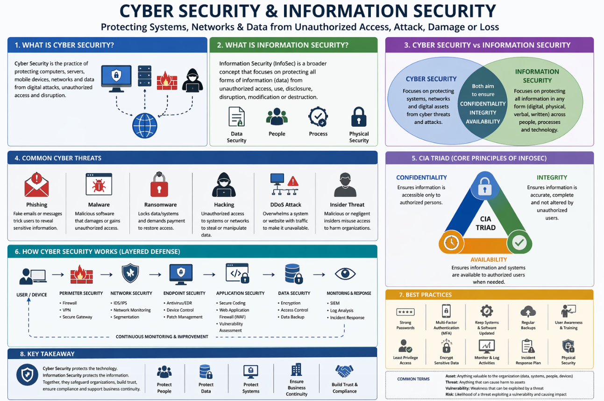

# 🔐 Cyber Security & Information Security 

  

##  About
This repository contains resources, notes, tools, and practice materials related to Information Security and Cyber Security.  
It is designed to help beginners learn the fundamentals and assist intermediate learners in improving their skills.

## 🔎 What is Information & Cyber Security?

**Information Security (InfoSec)** is the practice of protecting information from unauthorized access, use, disclosure, disruption, modification, or destruction. It ensures the confidentiality, integrity, and availability (CIA) of data.

**Cyber Security** is a subset of Information Security that focuses on protecting systems, networks, and digital devices from cyber attacks such as hacking, malware, phishing, and data breaches.

##  GitHub CyberSecurity Repos

* [Aweasome-CyberSecurity](https://github.com/fabionoth/awesome-cyber-security)
* [Aweasome-Pentest](https://github.com/enaqx/awesome-pentest)
* [Penetration-Testing](https://github.com/wtsxDev/Penetration-Testing)
* [Penetration-Testing-Tools](https://github.com/mgeeky/Penetration-Testing-Tools)
* [Public-Pentesting-Reports](https://github.com/juliocesarfort/public-pentesting-reports)
* [Beginners-Network-Pentesting](https://github.com/hmaverickadams/Beginner-Network-Pentesting)
* [Hacker-Roadmap](https://github.com/sundowndev/hacker-roadmap)
* [Web-Pentesting-Scratch](https://github.com/PacktPublishing/Learn-Website-Hacking-Penetration-Testing-From-Scratch)
* [Awesome-Pentest-Cheetsheet](https://github.com/coreb1t/awesome-pentest-cheat-sheets)
* [Awesome-Security](https://github.com/sbilly/awesome-security)
* [Personal-Security](https://github.com/Lissy93/personal-security-checklist)
* [Awesome-Cyber-Skills](https://github.com/joe-shenouda/awesome-cyber-skills)
* [Awesome-Hacking](https://github.com/carpedm20/awesome-hacking)
* [Awesome-Cyber-Security](https://github.com/okhosting/awesome-cyber-security)
* [awesome-cybersec](https://github.com/theredditbandit/awesome-cybersec)
* [Awesome-Security](https://github.com/mbcrump/awesome-security)
* [Awesome-Blue-Team-CyberSecurity](https://github.com/fabacab/awesome-cybersecurity-blueteam)
* [Awesome-Infosec](https://github.com/onlurking/awesome-infosec)
* [CyberSecurity](https://github.com/harisqazi1/Cybersecurity)
* [NIST CyberSecurity Resources](https://www.nist.gov/itl/applied-cybersecurity/nice/resources/online-learning-content)

## 🎯 Objectives
- Learn Cyber Security fundamentals  
- Understand Ethical Hacking concepts  
- Gain hands-on experience with security tools  
- Practice with real-world scenarios and CTF challenges  

## 📂 Contents
- 📘 Notes (Networking, Operating Systems, Security Basics)  
- 🛠️ Tools (Nmap, Wireshark, Metasploit, etc.)  
- 💻 Scripts (Python / Bash)  
- 🧪 Labs & Practice  
- 🚩 CTF Writeups  

## ⚠️ Disclaimer
This repository is intended for educational purposes only.  
Any misuse of the information or tools provided here is strictly the responsibility of the user.

## 📬 You can Follow me
- GitHub: https://github.com/ahnaf-hasan/
  

## ⭐ Support
If you find this repository helpful, please consider giving it a ⭐!